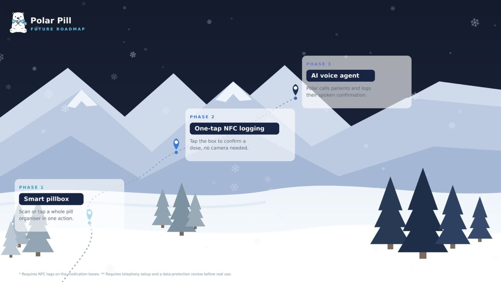

# Polar Pill 🐻‍❄️💊

[](https://youtu.be/7IoElkxIfA4)

**Medication support built for families.**

Polar Pill is a native iOS medication companion for families and carers. It helps elderly patients, people with multiple chronic conditions, and patients with memory problems stay on top of their medication — while giving remote family members visibility and peace of mind.


## Features

**For patients** (designed for elderly users — big targets, few taps):
- Home screen showing the next dose front and center
- Confirm a dose by scanning the QR label on the medication box (or manually)
- Celebration screen with adherence streaks
- One-tap "Call a family member"
- Local dose reminders

**For caregivers:**
- Family dashboard with each member's medications and live Taken/Missed/Later statuses (Supabase Realtime)
- Add/edit medications: dosage, time, daily/weekly/custom schedules, reminders
- Printable QR labels for medication boxes (AirPrint / PDF)
- Missed-dose alerts: a server-side sweep flags overdue doses and notifies caregivers, with a "Check in on Mum" screen and one-tap calling
- Weekly/Monthly/Yearly adherence reports: charts, plain-language summary, PDF export to share with clinicians
- Family invites via shareable codes

## Tech stack

- **iOS**: Swift / SwiftUI, MVVM, iOS 17+, Swift Charts, VisionKit (QR scanning), CoreImage (QR generation), UserNotifications
- **Backend**: [Supabase](https://supabase.com) — Postgres with Row Level Security, Auth, Realtime, pg_cron

## Project structure

```
Polar Pill/            SwiftUI app (App, Core, DesignSystem, Features)
Config/                Build configuration (credentials template)
SupportFiles/          Info.plist (merged at build time)
supabase/migrations/   Database schema, RLS policies, functions
```

## Getting started

1. **Clone & open** `Polar Pill.xcodeproj` in Xcode 16+.
2. **Create a Supabase project** at supabase.com, then run each file in `supabase/migrations/` (in order) in the SQL Editor.
3. **Configure credentials**: copy `Config/Config.example.xcconfig` to `Config/Config.xcconfig` and fill in your project URL and anon key (Dashboard → Project Settings → API).
4. Recommended for development: Supabase → Authentication → Sign In / Up → turn **Confirm email** off.
5. Build & run. Sign up as a caregiver, add a family member, add medications — then sign up as a patient with the member's invite code (Settings tab) to see the patient experience.

## Security notes

- Every table is protected by Row Level Security: patients access only their own data, caregivers only their linked family — enforced in Postgres, not the client.
- The anon key in `Config.xcconfig` is a public client key gated by RLS; no privileged keys ever ship in the app.

## Future roadmap



Designed for but out of scope in the current build.

* **Smart pillbox** — For patients on several medications, confirm a full pill organiser in one scan or tap rather than logging each dose separately.

* **NFC tap-to-confirm** — Put an NFC tag on the medication box so a patient can confirm a dose with a tap instead of scanning a QR code. Each tag holds a URL to the confirm endpoint, so a tap works on any modern iPhone with no app install. QR stays as the fallback.

* **Polar voice agent** — An outbound agent a caregiver can send to phone a family member, remind them warmly to take their medication, and take a verbal confirmation that writes back to Supabase and updates the dashboard. Built on ElevenLabs Conversational AI for voice, Twilio for telephony, and Supabase Edge Functions to trigger the call and receive the result (no keys in the app), with a 10-minute cap. Automated health calls to vulnerable people need consent, opt-out, calling-hour limits, agent self-identification, and a data-protection review first (see `COMPLIANCE-automated-calling.md`). Out of scope for now because importing a voice number takes a few days of carrier verification; an interim version runs the same agent as in-app voice.
  
